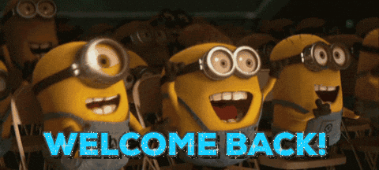

# Welcome to CnD Specialization

Congratulations on making it through phase-1 of the camp. If you couldn't complete all of the tasks, No Problem !

You just need to know some basics about pybullet.

So fasten up your seatbelts as we launch into the universe of controls!

## What'll you learn?
* In **Subpart 1**, we'll talk about some simple search algorithms and Kalman Filter.
* In **Subpart 2**, we'll talk about **Reinforcement Learning** and you'll learn to make your own environments for training.
* In **Subpart 3**, you'll get to train your own very first model from scratch!!
