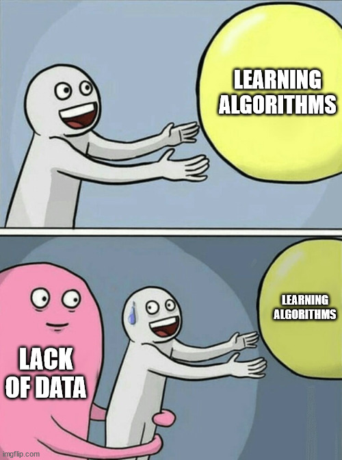
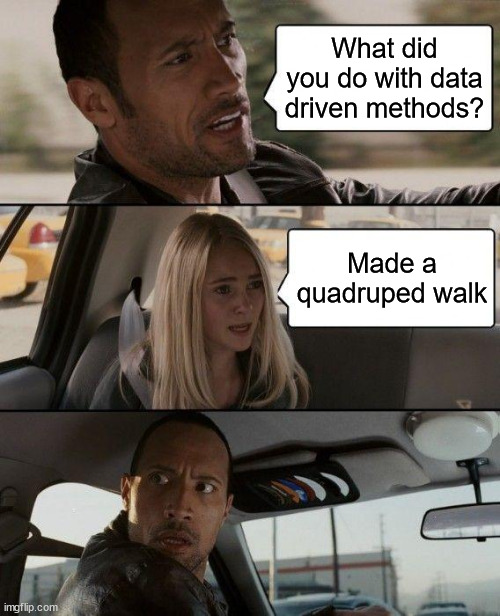
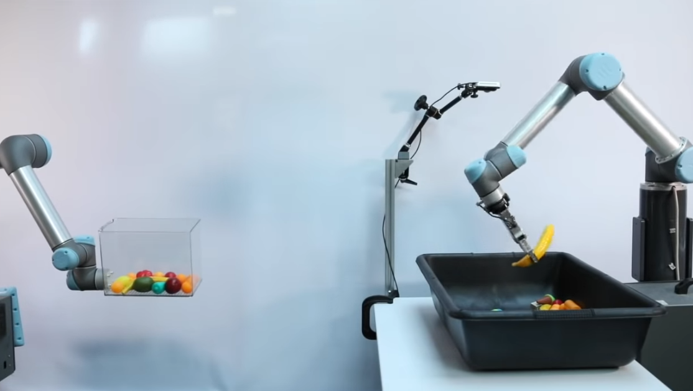
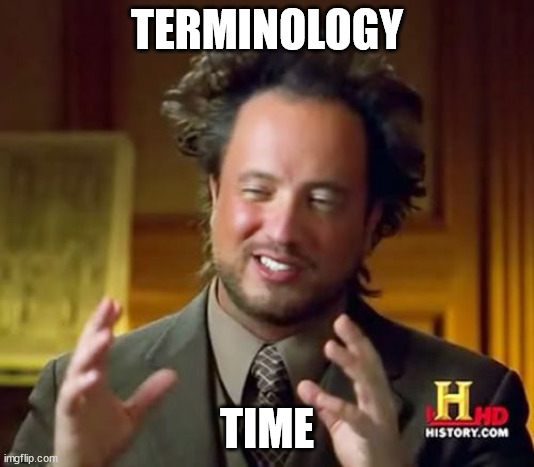
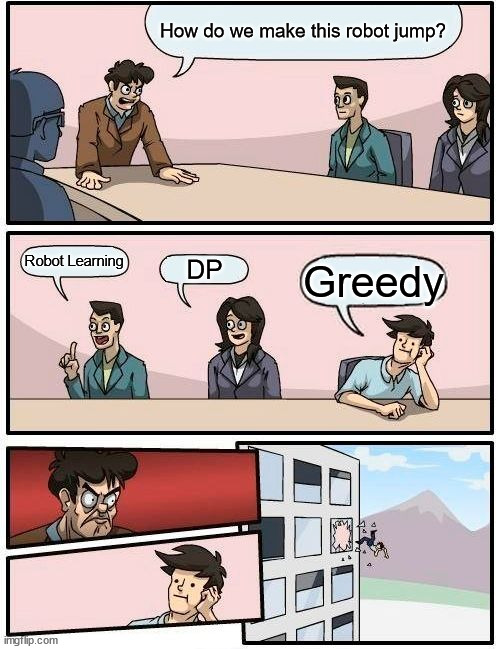
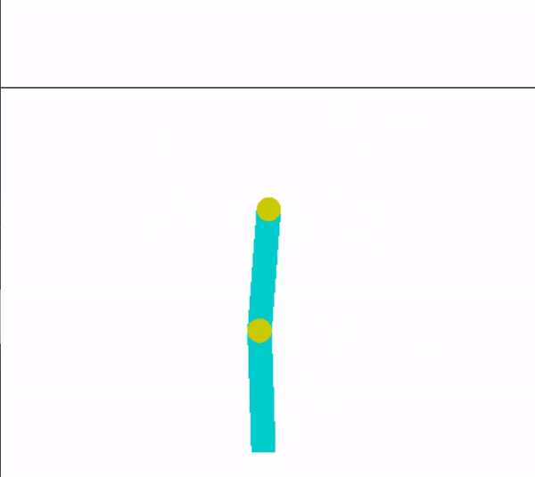
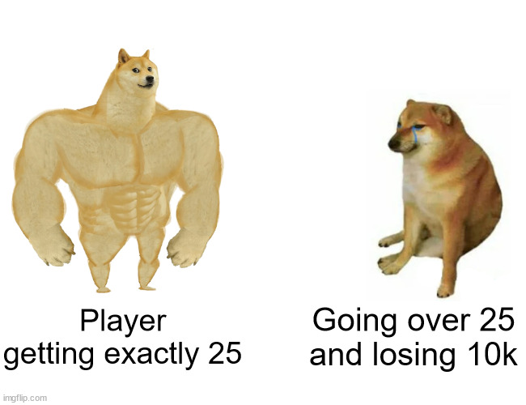

# Introduction to Robot Learning
Robot Learning is a field of Robotics where we study techniques based on learning algorithms, which help a robot in acquiring new skills and adapting to it's environment. These skills can vary from making a robotic arm move to making a quadruped walk.

By learning, what we mean here is, the robot learns what to do based on its own actions, with the help of some algorithms which we'll be covering in this specialization.

But before we jump into Robot Learning, we first need to discuss an important part of all Learning based methods - DATA.

## Data Driven Methods
In today's world, there is a large amount of data in almost every field. This data can range from images to text to statistical data. And learning algorithms use this to their benefit, to learn from the data, some patterns or anything useful which can help them do their specified tasks.
  

## What kind of Data for Robots
So you must be wondering what exactly will be the data that robots will look at? Well, since each robot is different, and the tasks that we may want to carry out can be completely different than those done before, it is difficult to have data which generalizes to each and every robot, therefore we need to collect data for each task and robot separately. And this data is in the form of robotic interactions with it's environment. E.g :- Let us say that a quadruped is trying to walk. Obviously it will be unable to do so initially, but running a large number of trials and collecting data about these trials, as to what action did the robot do, and what was the outcome after those actions. This is the kind of the data that will help in our learning algorithms.

These kind of approaches to robotics, which rely on Data, are called Data Driven Methods, as they utilize this data in order to learn new things.

 

You can check this video out to understand, what all can be done using data driven methods for robotics.

[<b>Robots Learning to Toss</b>](https://www.youtube.com/watch?v=-O-E1nFm6-A)

<b>Note: The next section requires you to have some basic knowledge about neural networks and deep learning.</b> So for those who are not familiar with these topics, we recommend you to go through the following course:
[Neural Networks and Deep Learning](https://www.coursera.org/learn/neural-networks-deep-learning)

### How is Robot Learning different from Supervised Learning?
There is always a supervisor in Supervised learning, telling what exactly is the answer for a given data point, (e.g. labels telling which image is of a dog, and which image is of a cat), and your model learns accordingly to differentiate between images of cats and dogs.

In robot learning, we don't have any such supervisor, because we actually don't know what action to take in what situation so that we will are able to achieve our task. (Also, the number of positions your robot can be in can be very large (e.g. Having 8 joints, with each having a lower limit of -pi and upper limit of pi)).

So instead of having such a supervisor, we have reward points. If the robot is able to accomplish some task, we give it reward points, so the robot is inclined towards finding a way to solve the task, and here we can have full control over the way we want to give it reward points.

However, a key concept in robot learning, is the fact that the rewards might be delayed from the perspective of the robot. That is, taking some action might not have an immediate effect and only after a large number of actions have taken place, will you be able to understand whether that action take a long time back was good or bad. In technical terms, we say that the feedback is delayed.

Due to us working with robots, which act in the real world, time and sequential nature of the problem really matters, unlike in supervised learning, where the entire data can be given at once, and there is no temporal relation between the data points.

# Basics of Robot Learning
In the first subpart of the week, you were vaguely introduced to the concept of rewards. Here we will formally define what exactly are rewards, as well as some other key terminology related to Robot Learning.
  

## Key Terminology

<li><b>Timesteps</b> - Same as timesteps in PyBullet.</li>
<li><b>Agent</b> - From now on, we'll be calling our robot <b>agent</b>, as this is the technical term for whatever we our trying to train, in the field of robot learning. You can see an agent as the brain of the entire process, as it is the agent which decides what action to take based on the reward points, it gets. </li>
<li><b>Rewards</b> - A reward is a scalar feedback signal, in the form of a number Rt. This number indicates the reward that the agent will get at a timestep t. So, being in a good position will fetch positive reward, whereas a bad position will fetch negative reward. (There is no strict rule regarding reward formulation, and you can model it in any way you want.)
<li><b>Environment</b> - The surroundings of the agent, with which it interacts. </li>
<li><b>Observation</b> - As the agent interacts with its environment, it will be able to observe some things in the environment. It is on the basis of these observations combined with rewards, that the agent makes decisions. </li>
<li><b>Action</b> - The actions that the agent takes.
<li><b>State</b> - A structure which encapsulates the summary of the entire history of observations, rewards and actions. The agent generally takes actions based on this state.

## So what exactly is the goal in Robot Learning?
We want our robot to accomplish some task, and hence make sequential decisions. So to solve this problem of sequential decision making, we maximize the expected cumulative future reward for the agent. 
A thing to note here is that actions of the agent can have long term consequences, hence it won't be beneficial to use a greedy approach, because a greedy approach might look the best thing to do for short term rewards, but it might lead to leser overall reward.

 

## The Entire Process of Interaction
 

## Some More Terminology :)
<li><State Space - The entire set of all possible states, is called the state space.
<li>Action Space - The entire set of all possible actions, is called the action space.
<li> Policy - This can be seen as the agent's behaviour function, and is a mapping from the state space to action space. i.e. given a state, it will give as output, what action should be taken.
<li>Value function - A function which takes as input a state, and tells how good it is to be in this state. i.e. given a state, it will return a numeric number which indicates the total future reward we will get.
<li>Action Value function - A function which takes as input a state, and an action, and tells how good it is to take that action in this particular state.
<li>Model - Agent's representation of the environment. So the environment will be affected by the agent's actions and then the environment gives some observations to the agent, based on it's own model.

<b>To get more intuition about these things, you can go through the first 2 videos of the following playlist:
[RL Course by David Silver](https://www.youtube.com/playlist?list=PLqYmG7hTraZDM-OYHWgPebj2MfCFzFObQ) </b>

 

# OpenAI Gym
To solve any problem, you need to first formulate it well. You need to define the agent, the environment, what all will be included in the action space, state space, and what will be the rewards that the agent gives. And most of time in robotics, you will be maing custom environments, as these give you a lot of control over the problem, and how you want to solve it.

Gym, provided by OpenAI, is a python library that can be used for building your own custom environments for Robot Learning, as well as testing your own algorithms on inbuilt environments. These environments have the same structure, which is why you can easily write general algorithms, which work on any enviroment.

## Installing OpenAI Gym
The OpenAI Gym is very easy to install, you just need to run the following command on your terminal:
~~~bash
pip install gym
~~~
And that's it 😀! Now you can easily build environments for your robots to learn in.

## Getting started with Gym
~~~
import gym
env = gym.make('CartPole-v0')
env.reset()
for _ in range(1000):
    env.render()
    env.step(env.action_space.sample()) # take a random action
env.close()
~~~
Let us go through the above code, to make it clear, on how to use gym. This code is also available [here](https://gym.openai.com/docs/) along with a basic introduction on how to use gym.

Steps:
1. So here, we start of with importing gym, similar to all other libraries in python.
2. Then the next step, is to make an environment of your choice using the <b>gym.make</b> command. Note that these environments our inbuilt in Gym, and we'll look at how to make custom environments, in the next week. You can have a look at the different environments [here.](https://gym.openai.com/docs/) Here we have used the <b>CartPole Env.</b>
3. The reset function is used to reset the environment to it's original state, as if no action has taken place. This is required when the episode terminates. (Episode terminates only if the bot has accomplished a task, or done something which it is not supposed to do, e.g. if a quadruped falls down, while trying to learn how to walk).
4. Then we use a for loop, to run the agent in the environment. And in each iteration, we render the env, (to show the env in RealTime), and then do a step. This structure is very similar to what you have studied in PyBullet.
5. The env.action_space.sample, just takes out a sample action at random and feeds it into the env. This simulates a random agent doing actions in the environment. 
6. Close the environment.

 

Acrobot Environment in OpenAI Gym

## Different types of Spaces in Gym
To define the range in which your actions and observations can belong, and the type of these variables, i.e. continuous or discrete, needs to be defined in the environment, and gym provides Spaces, to deal with this efficiently.

Although there are many types of spaces, the two most important and widely-used spaces are:
 
<b>Box</b> - When you want to measure continuous values like maybe the joint angles, or apply actions which can be any real value,like -3.8787, then we use the Box space. It is used for defining continuous ranges.
It has two common use cases:
~~~Bash
Box(low=-1.0, high=3.0, shape=(3, 4), dtype=np.float32)
~~~
This defines a range of 12 variables, that can have any real value from -1 to 3, and the shape of this matrix will be a 3*4 matrix. Hence, all the values here will have the same range.
~~~Bash
Box(low=np.array([-1.0, -5.0]), high=np.array([3.0, 6.0]), dtype=np.float32)
~~~
This defines a space of two variables, the first variable having range from -1 to 3, and the second having range from -5 to 6. This is generally used, when the variables can have different ranges.
  
<b>Discrete</b> - Used for variables that have discrete value, e.g. directions, whether to go up, down, left or right.
~~~Bash
Discrete(5)
~~~
This will create a space, with 5 possible values, 0, 1, 2, 3, 4, all defining different values of that variable.

## Creating an Env
You can find the boilerplate code for creating an Env [here](./Env.py). This code has detailed instructions about how to create your own env, and the entire structure of the Environment.

## Task - Creating Your Own Environment
Let us introduce you to a card game known as RoboCards. RoboCards is a card game where the goal is to obtain cards that sum to as near as possible to 25 without going over.
 
The gameplay of the game is as follows:
<li> The player is playing against a fixed dealer.
<li> Face cards (Jack, Queen, King) have point value 10.
<li> Aces can either count as 11 or 1, and it's called 'RoboAce' at 11.
<li> This game is placed with an infinite deck (or with replacement).
<li> The game starts with dealer having one face up and one face down card, while player having two face up cards.
<li> The player can request additional cards until they decide to stop or exceed 25 (But note, exceeding 25 will result in a loss).
<li> After the player stops drawing cards from the deck, the dealer reveals their facedown card, and draws until their sum is 20 or greater.  If the dealer goes bust the player wins.
<li> If neither player nor dealer goes over 25, the outcome (win, lose, draw) is decided by whose sum is closer to 25.  <li> The reward for winning is +1, drawing is 0, and losing is -1.
  

The task for this part is to create an environment which simulates this process. The things which need to be completed are:
1. Defining an observation space, where the observation is a tuple of 3 discrete variables: the sum of the values of the cards for the player, the value of the card with the dealer having face up, and whether the player has a RoboAce. (While taking the sum of the values of the card, if the player has a Ace, and using it as RoboAce doesn't make the sum go over than 25, then you need to consider the Ace as 11 else 1, same goes for whether there is a RoboAce or not).
2. Defining an action space, which tells the player whether to draw a card, or stop.
3. Reward Function - which gives the reward to the player, as defined in the gameplay.
4. Implementing the step function by taking an action as argument, (action meaning draw or stop). If the player goes over 25, terminate the episode and give -1 reward, if the player stops, then while the total sum of the dealer's cards is less than 20, keep drawing cards for the dealer.
5. Function to get the observation from the environment.
6. Fuction to reset the environment. After reset, both the player and the dealer should have two cards at random.
7. A class which contains all these functions.

<b> Note: Every step mentioned above has points, and the total points will be the sum of the points for each part.</b>

Do feel free to contact us on the discord group, in case of any doubts!

